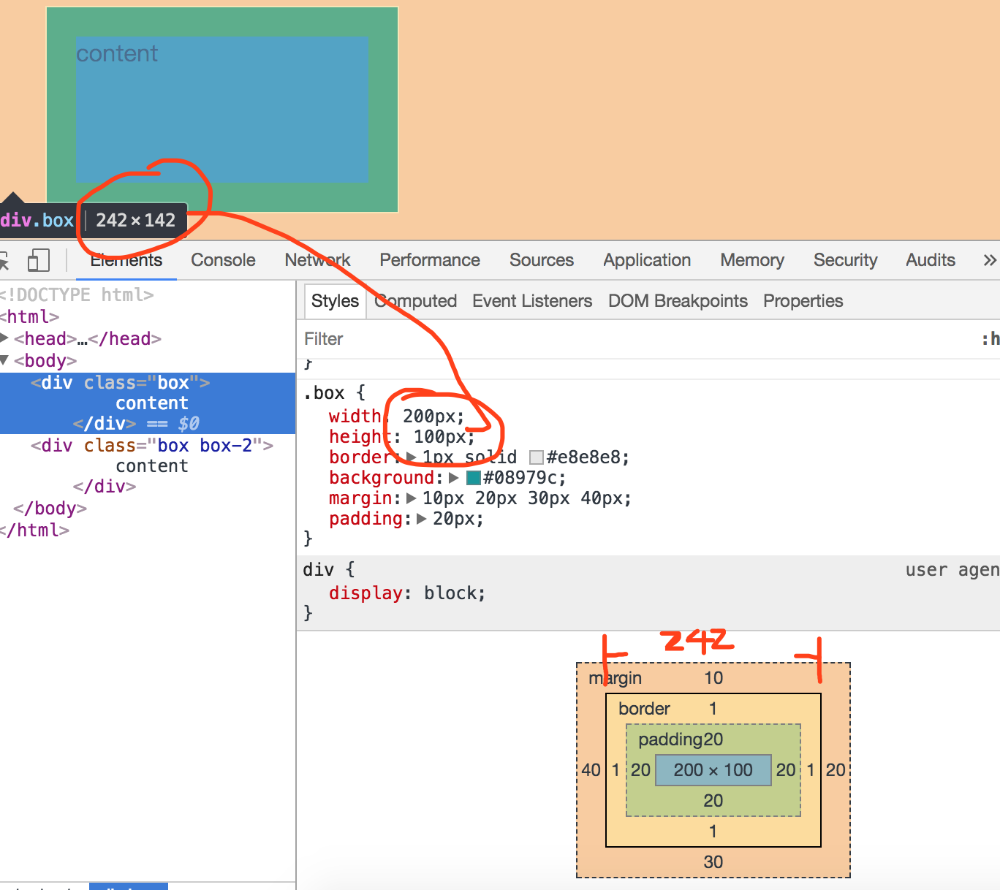

## 盒子模型



[源码](../demos/box.html)

```css
.box {
  width: 200px;
  height: 100px;
  border: 1px solid #e8e8e8;
  background: #08979c;
  margin: 10px 20px 30px 40px;
  padding: 20px;
}
```
默认的width、height的值为内容content的值(content-box)<br/>
盒子的实际宽度为: content-box + padding + border<br/>

使用css3来改变这种默认行为
```css
.box-2 {
  box-sizing: border-box;
}
```
