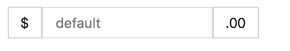

## 居中

## 水平居中
[示例源码](../demos/center-h.html) <br/>
1. text-align: center
适用文本及行内元素
```css
.demo-1 {
  text-align: center;
}
```
2. margin
适用块级元素，并且子容器需要设置宽度
```css
.demo-2 .child {
  margin: 0 auto;
}
```
3. 绝对定位 + transform
absolute相对于第一个使用定位属性的父元素进行计算，此处需要给父元素设置定位<br/>
tips: transform在低版本的安卓系统支持较差，需要使用厂商前缀
```css
.demo-3 {
  position: relative;
}
.demo-3 .child {
  position: absolute;
  top: 0;
  left: 50%;
  transform: translateX(-50%);
}
```
4. flex
css3的新增的弹性布局，现代浏览器都已支持
```css
.demo-4 {
  display: flex;
  justify-content: center
}
```

## 垂直居中
1. 文本
上下内边距相等<br>
行高和容器高度相等<br/>

2. table
```css
.parent {
  display: table;
  width: 100%;
}
.child {
  display: table-cell;
  vertical-align: middle;
  text-align: center;
}
```
3. 绝对定位 + transform
```css
.parent {
  position: relative;
}
.parent .child {
  position: absolute;
  left: 0;
  top: 50%;
  transform: translateY(-50%);
}
```

4. 绝对定位 + margin<br/>
在知道元素高度的情况下可使用margin替代transform
```css
.parent {
  position: relative;
}
.parent .child {
  position: absolute;
  left: 0;
  margin-top: 元素高度的一半
}
```

5. flex
```css
.parent {
  display: flex;
  align-items: center;
}
```

### 水平垂直都居中
组合水平、垂直居中

### 例子
[源码](../demos/center-v.html)


