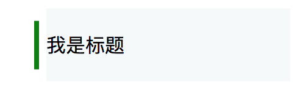

# position

position指定布局方式。是最常用的属性之一。常用的有relative, absolute, fixed。<br/>

#### static
- 默认

#### relative
- 相对定位
- 不脱离文档流
- 参照物为元素本身
- 应用：为作绝对定位的参照物

#### absolute
- 绝对定准
- 脱离文档流
- 默认宽度为内容宽度
- 参照物为第一个定位的父元素/根元素
- 应用：固定位置定位、放到容器外的效果

#### fixed
- 固定定位
- 默认宽度为内容宽度
- 脱离文档流
- 参照物为浏览器视窗
- 应用：遮罩、固定导航

#### 你可能需要使用z-index来改变层级
- 设置z轴上的排序，默认值为0
- 在未设置position的情况下，z-index无效
- z-index栈：跟父元素的z-index大小有关

### 常见的用法示例：
#### 使用relative实现容器重叠效果
```css
.top {
  height: 200px;
  width: 90%;
  margin: 0 auto;
  background: #f5f9fa;
}
.container {
  width: 70%;
  margin: auto;
  height: 600px;
  border: 1px solid #ccc;
  border-radius: 4px;
  box-shadow: 0 0 12px 2px #ccc;
  position: relative;
  top: -50px;
  background: #fff;
}
```
```html
<div class="top">
  top content
</div>
<div class="container">
  relative container
</div>
```

#### 使用relative作为absolute参考元素，实现菜单选中效果

```css
.title {
  margin: 100px;
  width: 200px;
  height: 60px;
  line-height: 60px;
  background: #f5f9fa;
  position: relative; /* 作为absolute的参考元素 */
}
.title:before {
  content: '';
  height: 66%;
  width: 4px;
  background: green;
  position: absolute;
  left: -10px;
  top: 50%;
  transform: translateY(-50%);
}
```
```html
<div class="title">我是标题</div>
```

#### 遮罩效果
```css
.cover {
  position: fixed;
  left: 0;
  top: 0;
  width: 100%;
  height: 100%;
  background: rgba(0,0,0,.5);
  z-index: 999;
}
.content {
  background: #fff;
  width: 200px;
  height: 200px;
  border-radius: 4px;
  position: fixed;
  left: 50%;
  top: 50%;
  transform: translate(-50%, -50%);
  z-index: 1000;
}
```
```html
<div class="cover">
  <div class="content">
    content
  </div>
</div>
```
